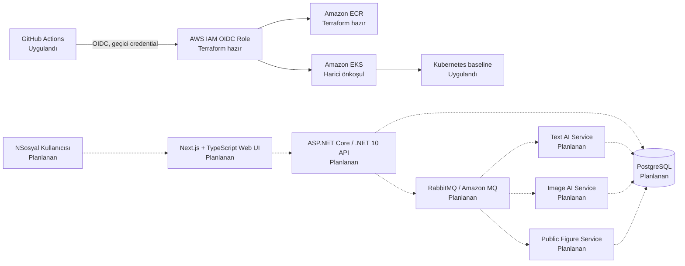
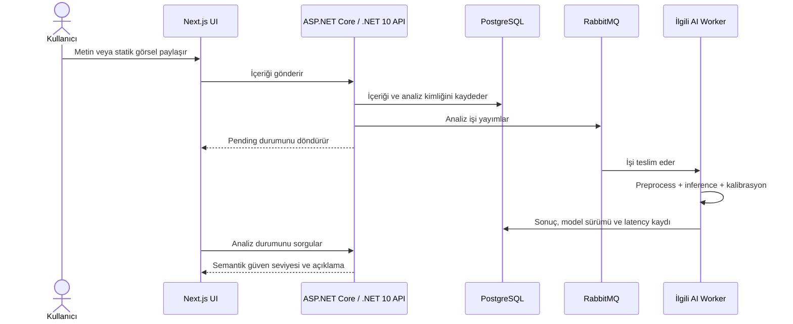
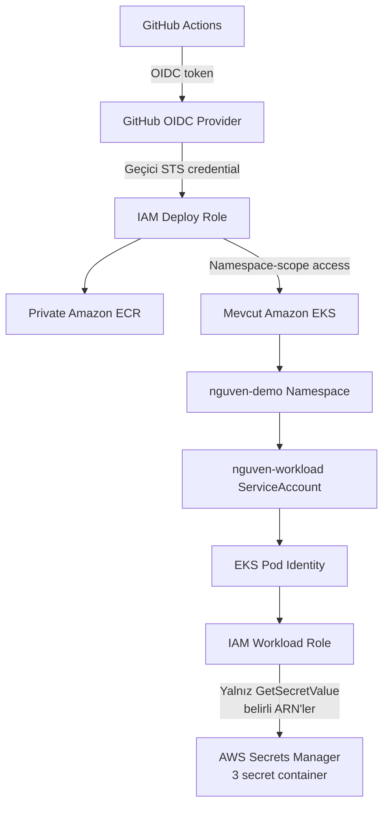

/opt/homebrew/Library/Homebrew/cmd/shellenv.sh: line 18: /bin/ps: Operation not permitted
# N-Güven

N-Güven, NSosyal odaklı bir içerik güveni ve şeffaflık platformu olarak tasarlanmaktadır. Amaç; Türkçe metin ve statik görsellerde AI üretimi veya sentetik içerik olasılığına ilişkin işaretleri analiz etmek, belirsizliği saklamadan kullanıcıya anlaşılır bir karar-destek sinyali sunmaktır.

N-Güven **faktüel doğruluk tespiti yapmaz**, genel amaçlı bir fact-checking sistemi değildir ve içeriği otomatik olarak kaldırmaz ya da moderasyona tabi tutmaz. “İçerik özgünlüğü / üretim sinyali”, bir içeriğin nasıl üretilmiş olabileceğine ilişkin model çıktısıdır; “faktüel doğrulama” ise içerikteki iddiaların kanıtlarla doğru olup olmadığını araştırır. Bu iki problem birbirinin yerine kullanılamaz. Kamu figürü bağlamı yalnızca kontrollü bir referans galerisi ve yüksek güven eşiğiyle, sınırlı bir bağlam sinyali olarak planlanmaktadır.

> **Proje durumu — başlangıç iskeleti:** Bu depo güvenli public-repository, GitHub Actions OIDC, Terraform IAM/ECR/Secrets Manager ve Kubernetes namespace/service-account temeline ek olarak Türkçe metin AI servisi için modelden bağımsız FastAPI sözleşme temelini ve tekrarlanabilir ML değerlendirme hattını içerir. Gerçek ML modeli, ASP.NET Core / .NET 10 backend, Next.js + TypeScript frontend, PostgreSQL, RabbitMQ ve uygulama workload'ları henüz eklenmemiştir. Aşağıdaki her bölüm mevcut durum ile hedef mimariyi ayrı etiketler.

## İçindekiler

- [Projenin Amacı](#projenin-amacı)
- [Durum ve Özellikler](#durum-ve-özellikler)
- [Sistem Mimarisi](#sistem-mimarisi)
- [İçerik Analiz Akışı](#i̇çerik-analiz-akışı)
- [Repository Yapısı](#repository-yapısı)
- [Commit Geçmişi](#commit-geçmişi)
- [Frontend](#frontend)
- [Backend](#backend)
- [Veri Katmanı](#veri-katmanı)
- [Asenkron İşleme ve RabbitMQ](#asenkron-i̇şleme-ve-rabbitmq)
- [Yapay Zekâ Mimarisi](#yapay-zekâ-mimarisi)
- [Model Doğrulama ve Değerlendirme](#model-doğrulama-ve-değerlendirme)
- [Güven Seviyeleri ve Kalibrasyon](#güven-seviyeleri-ve-kalibrasyon)
- [AWS Altyapısı](#aws-altyapısı)
- [Ölçeklenebilirlik](#ölçeklenebilirlik)
- [CI/CD](#cicd)
- [Güvenlik](#güvenlik)
- [Yapılandırma](#yapılandırma)
- [Yerel Geliştirme](#yerel-geliştirme)
- [Testler](#testler)
- [AWS'e Dağıtım](#awse-dağıtım)
- [Gözlemlenebilirlik](#gözlemlenebilirlik)
- [Kapsam](#kapsam)
- [Yol Haritası](#yol-haritası)
- [Takım ve Sorumluluklar](#takım-ve-sorumluluklar)

## Projenin Amacı

N-Güven'in ürün ve araştırma hedefleri şunlardır:

1. Türkçe metinlerde AI üretimi olasılığına ilişkin sinyalleri analiz etmek.
2. Statik görsellerde AI üretimi/sentetik içerik sinyallerini analiz etmek.
3. Ham olasılığı mutlak gerçek gibi sunmak yerine **Düşük / Belirsiz / Yüksek** gibi semantik güven seviyeleri göstermek.
4. Belirsiz model çıktılarını kesin hükme dönüştürmemek ve yanlış pozitifleri kontrol etmek.
5. Uygun koşullarda sınırlı ve doğrulanmış kamu figürü bağlamı sağlamak.
6. Bireysel profilleme yerine toplulaştırılmış platform analitiği üretmek.
7. AI inference işlemlerini sosyal akışın/API'nin kritik yolundan ayıran asenkron bir mimari kurmak.
8. Yarışma demosunun CPU odaklı AWS altyapısında ekonomik biçimde çalışabileceğini ölçmek.

Bu hedefler proje yönünü tanımlar; bir hedefin burada yer alması uygulanmış veya doğrulanmış olduğu anlamına gelmez.

## Durum ve Özellikler

| Durum | Bileşen | Depodaki kanıt |
| --- | --- | --- |
| Uygulandı | Public repo secret koruması | `.gitignore`, placeholder-only `.env.example`, Gitleaks workflow'u ve tracked-file policy kontrolü |
| Uygulandı | GitHub Actions → AWS OIDC kalıbı | `demo` environment kullanan, `id-token: write` yetkili deployment workflow'u |
| Uygulandı | Sınırlı AWS IAM taslağı | Repository ve environment ile kısıtlı trust policy; ECR/EKS izinleri Terraform'da |
| Uygulandı | Runtime secret kaynakları | Secrets Manager secret container'ları; Terraform hiçbir secret value yönetmez |
| Uygulandı | EKS workload identity taslağı | EKS Pod Identity ile yalnızca üç N-Güven secret ARN'ine `GetSecretValue` izni |
| Uygulandı | Kubernetes başlangıç kaynakları | `nguven-demo` namespace, service account ve yalnız non-sensitive ConfigMap |
| Hazır, apply edilmedi | ECR, IAM, Secrets Manager ve EKS erişim kaynakları | Terraform tanımları vardır; canlı AWS hesabına uygulanmamıştır |
| Planlanan | Next.js + TypeScript frontend ve ASP.NET Core / .NET 10 backend | Sorumluluk dizinleri boştur; çalıştırılabilir proje yoktur |
| Planlanan | PostgreSQL, RabbitMQ/Amazon MQ | Uygulama ve deployment tanımları henüz yoktur |
| Uygulandı, model yok | Türkçe metin AI servis temeli | Typed FastAPI sözleşmeleri, deterministik yapılandırılmamış inference adaptörü, pytest sözleşme testleri ve non-root Dockerfile |
| Uygulandı, sonuç yok | ML değerlendirme hattı | Manifest/tahmin/sonuç şemaları, duplicate ve leakage kontrolleri, deterministik split, modelden bağımsız metrik hesaplama ve pytest testleri |
| Planlanan | Görsel ve kamu figürü AI servisleri | Servis dizinleri boştur; model ağırlığı, inference veya ölçüm sonucu yoktur |
| Planlanan | Analiz kaydı, content-hash reuse, feedback ve analitik | Şema/API/iş kodu henüz yoktur |

Dolayısıyla bugün klonlanan depo bir uygulama demosu çalıştırmaz; güvenli geliştirme ve dağıtım tabanı sağlar.

## Sistem Mimarisi

Hedef mimari, kullanıcıya hizmet eden web/API katmanını pahalı AI inference işlerinden kuyrukla ayırır. Kesintisiz çizgiler depoda tanımı bulunan başlangıç altyapısını, kesikli bağlantılar ise planlanan uygulama akışını gösterir.



Bugünkü deployment workflow'u yalnızca Kubernetes baseline'ını doğrular ve uygular. Container build/push ve uygulama rollout adımları, gerçek Dockerfile ve workload manifestleri eklendiğinde devreye alınacaktır.

## İçerik Analiz Akışı

Aşağıdaki akış hedef tasarımdır; henüz çalışır bir uygulama implementasyonu değildir.



Bu ayrım sayesinde sosyal akış/API pahalı inference tamamlanana kadar beklemez. Retry/backoff, dead-letter queue, acknowledgement, idempotency, analysis ID ve content hash davranışları henüz uygulanmamıştır. Uygulama aşamasında mesaj sözleşmeleri ve veritabanı benzersizlik kısıtlarıyla birlikte tasarlanacaktır.

## Repository Yapısı

```text
n-guven/
├── .github/workflows/
│   ├── ai-validation.yml
│   ├── deploy-eks.yml
│   └── security.yml
├── apps/
│   ├── backend/                 # Planlanan ASP.NET Core / .NET 10 uygulaması
│   └── web/                     # Planlanan Next.js + TypeScript uygulaması
├── services/
│   ├── text-ai/                 # FastAPI sözleşme temeli; model yüklenmez
│   ├── image-ai/                # Planlanan görsel servisi
│   └── public-figure-ai/        # Planlanan sınırlı bağlam servisi
├── ml/evaluation/               # Doğrulama, leakage-safe split ve offline değerlendirme hattı
├── infrastructure/
│   ├── kubernetes/              # Base + demo Kustomize kaynakları
│   └── terraform/               # IAM, ECR, Secrets Manager, Pod Identity
├── docs/                        # Gelecekteki odaklı teknik belgeler
├── scripts/                     # Gelecekteki geliştirici otomasyonları
├── .env.example
├── .gitleaks.toml
├── .gitignore
└── README.md
```

Boş uygulama dizinleri yalnız hedef sınırlarını görünür kılar; bu dizinler kod varmış gibi değerlendirilmemelidir. `services/text-ai/` bu durumun istisnasıdır ve yalnız servis/sözleşme temelini içerir. Altyapı tanımları additive hazırlıktır ve otomatik olarak canlı AWS kaynaklarına uygulanmamıştır.

## Commit Geçmişi

Repository geçmişi jüri ve teknik inceleme için atomik, bağımlılık sırasını izleyen Conventional Commits başlıklarıyla kurulmuştur:

| Sıra | Commit | Kapsam |
| ---: | --- | --- |
| 1 | `chore(repo): initialize secure public repository structure` | Root ignore kuralları, placeholder-only environment şablonu ve uygulama/AI sorumluluk dizinleri |
| 2 | `feat(infra): add secure AWS Terraform foundation` | Remote state hazırlığı, immutable GitHub OIDC trust, least-privilege IAM, ECR, Secrets Manager ve EKS Pod Identity |
| 3 | `feat(k8s): add demo namespace and workload identity baseline` | `nguven-demo` namespace, service account, non-sensitive ConfigMap ve Kustomize demo overlay |
| 4 | `ci(security): enforce secret scanning and infrastructure validation` | Gitleaks, tracked sensitive-file policy, Terraform validate ve Kubernetes render kontrolleri |
| 5 | `ci(deploy): add OIDC-based EKS baseline deployment` | GitHub `demo` Environment, geçici AWS credential, ECR login ve EKS baseline apply akışı |
| 6 | `docs(readme): document architecture, security and operations` | Gerçek/mevcut durum ayrımı, sistem/AI/AWS mimarisi, geliştirme, deployment, kapsam ve takım sorumlulukları |
| 7 | `feat(ai): scaffold text analysis service` | Modelden bağımsız FastAPI sözleşmesi, health endpoint'i ve non-root image |
| 8 | `test(ai): add text service contract tests` | Health, request validation ve yapılandırılmamış inference davranışı testleri |
| 9 | `feat(ml): add evaluation manifest foundation` | Dataset izlenebilirliği JSON Schema'sı ve kontrollü artefakt dizinleri |
| 10 | `feat(ml): add dataset manifest validation` | JSON/JSONL yükleme, schema doğrulama ve alan bazlı hata raporlama CLI'ı |
| 11 | `feat(ml): implement leakage-safe dataset splitting` | Duplicate, kaynak/üretici ailesi sızıntı kontrolleri ve tekrarlanabilir split ataması |
| 12 | `feat(ml): add reproducible evaluation runner` | Offline tahmin sözleşmesi, makro metrikler ve izlenebilir sonuç artefaktı |
| 13 | `ci(ai): validate text AI and evaluation contracts` | Python test paketleri ile non-root container build doğrulaması |
| 14 | `docs(ml): document evaluation workflow` | Uygulanan sınırlar, CLI akışı, veri yönetişimi ve kanıt/iddia ayrımı |

Her commit kendi teknik amacıyla incelenebilir; runtime secret, canlı AWS değişikliği veya uygulanmamış application özelliği commit geçmişinde tamamlanmış gibi gösterilmez.

## Frontend

**Durum: Planlanan.** `apps/web/` içinde henüz `package.json`, Next.js sayfası/bileşeni, test veya Dockerfile yoktur.

Hedef frontend yığını Next.js ve TypeScript'tir. Feed, içerik detayı, AI analiz rozeti, analiz açıklaması, semantik güven seviyesi, kontrollü kamu figürü bağlamı, kullanıcı geri bildirimi ve admin analitiği bu katmanın sorumluluğunda olacaktır. Ham model olasılığının ana kullanıcı sinyali olması yerine, kalibre edilmiş seviye ve belirsizlik açıklaması tercih edilecektir.

Erişilebilirlik yaklaşımı; semantik HTML, klavye navigasyonu, görünür focus, yalnız renge dayanmayan ikon + metin iletişimi, yeterli kontrast, screen-reader etiketleri ve mobil touch target'ları kapsayacaktır. WCAG 2.2 henüz doğrulanmış uyumluluk değil, tasarım hedefidir.

> `NEXT_PUBLIC_*` değişkenleri istemci bundle'ına giren **public yapılandırmadır**. Token, parola, JWT signing key veya başka bir server-side secret hiçbir zaman `NEXT_PUBLIC_*` değişkeninde tutulmamalıdır.

## Backend

**Durum: Planlanan.** `apps/backend/` içinde `.sln`, `.csproj`, controller/Minimal API, veri erişimi veya test projesi yoktur; bu nedenle Clean Architecture, MediatR, EF Core ya da başka bir yaklaşım uygulanmış gibi iddia edilmez.

Hedef teknoloji ASP.NET Core / .NET 10'dur. Backend'in planlanan sorumlulukları içerik/feed yönetimi, analiz orchestration, queue publishing, analiz sonucu sorgulama, feedback, admin/analytics iş kuralları, health endpoint'leri ve gözlemlenebilirliktir. Katman sınırları gerçek kodla birlikte belirlenecek ve bu bölüm uygulamaya göre güncellenecektir.

## Veri Katmanı

**Durum: Planlanan.** PostgreSQL şeması veya migration henüz yoktur.

Planlanan veri kapsamı; içerikler, analiz talepleri, kalibre edilmiş sonuçlar, model/sürüm metadata'sı, kullanıcı geri bildirimi, işlem durumu ve analitik kaynak kayıtlarıdır. Parolalar ve production connection string'leri repository içinde tutulmayacak; runtime'da Secrets Manager üzerinden sağlanacaktır. Private database endpoint'leri dokümana ya da örnek dosyalara yazılmayacaktır.

Demo için EKS üzerinde tek PostgreSQL pod + EBS PVC değerlendirilse bile bu, production HA sağlamaz. Production tasarım kararı ayrıca ölçüm, yedekleme ve operasyon gereksinimleriyle verilmelidir.

## Asenkron İşleme ve RabbitMQ

**Durum: Planlanan.** Queue declaration, publisher/consumer veya Docker Compose servisi henüz yoktur.

Kuyruğun temel amacı sosyal feed/API'nin pahalı AI inference işlemini senkron beklememesidir. Backend producer olarak analiz mesajını yayımlar; text/image/public-figure worker'ları ilgili mesajı tüketir ve sonucu kalıcı hale getirir. Local geliştirmede Docker RabbitMQ, AWS demo ortamında ise uygun maliyet doğrulandıktan sonra Amazon MQ for RabbitMQ hedeflenmektedir.

Queue/routing adları, manual acknowledgement, retry/backoff, DLQ ve idempotency kuralları sözleşme testleriyle birlikte eklenecektir. Amazon MQ kullanıcı adı ve parolası yalnız Secrets Manager'da tutulacaktır.

## Yapay Zekâ Mimarisi

**Durum: Türkçe metin servis/sözleşme temeli ile metin ve görsel model karşılaştırmaları uygulandı; production model entegrasyonu henüz yapılmadı.** AI servislerinin backend process'inden ayrılması; Python bağımlılıklarının izole edilmesini, CPU worker'larının API'den bağımsız ölçeklenmesini ve model sürümlerinin ayrı yönetilmesini amaçlar.

### Türkçe Metin Analizi

`services/text-ai/` altında Python 3.12/FastAPI uygulaması, `GET /health` ve `POST /v1/analyze/text` sözleşmeleri, merkezi karakter sınırı ve modelden bağımsız inference arayüzü bulunur. Mevcut deterministik adaptör skor üretmez; `UNAVAILABLE`, `not-configured` sürümleri ve açık yapılandırılmamış açıklaması döndürür.

ModernBERT-TR ve BERTurk aynı dondurulmuş protokol, üç seed ve 1.200 kayıtlık kapalı test kümesiyle fine-tune edilip karşılaştırılmıştır. İki aday da ortalama `0,999722` Macro-F1 elde ettiği için önceden tanımlanan latency tie-breaker uygulanmış; ortalama inference süresi `38,41 ms` olan BERTurk, `55,24 ms` ölçülen ModernBERT-TR önünde prototip entegrasyon adayı seçilmiştir. Her iki aday da kalite, yüksek güvenli false-positive ve p95 latency eşiklerini geçmiştir. Canonical sonuç [karşılaştırma kanıtında](ml/evaluation/comparisons/text-origin-tr-v1.json), karar kapsamı ise [ADR-0001](docs/adr/0001-select-berturk-for-text-origin-prototype.md) içinde kayıtlıdır.

Bu seçim production onayı veya farklı kaynaklarda genelleme iddiası değildir. Sonuçların kusursuza yakın olması kaynak/stil kısayolları riskini artırır; adversarial ve dış-domain veri, drift izleme ve servis entegrasyon testleri tamamlanmadan model kullanıcı trafiğine açılmayacaktır. Unicode/Türkçe normalizasyonu, tokenizer sürümü, duplicate kontrolü, kaynak-temelli ayrım, validation-only kalibrasyon ve artifact hash'leri deney protokolünde kayıt altındadır.

Model card veya üçüncü taraf benchmark değerleri N-Güven sonucu olarak sunulmayacaktır. Projenin kendi kapalı test protokolü tamamlanmadan başarı iddiası yapılmaz.

### Görsel Analizi

**Durum: Dondurulmuş karşılaştırma tamamlandı; uygun model bulunmadığı için servis entegrasyonu ertelendi.** Hash-pinned AIorNot SigLIP2 ve CapCheck ViT adayları, dış kaynak SynCred-Bench üzerindeki 450 insan ve 600 sentetik görselin altı dönüşümüyle değerlendirilmiştir. Her aday aynı 6.300 varyantı işlemiştir.

ViT `0,531738` Macro-F1 ve `0,508897` en zayıf dönüşüm Macro-F1 ile sıralamada birincidir; ancak `0,306667` high-confidence false-positive oranı ve kalite değerleri kabul hedeflerini geçmemiştir. SigLIP2'nin Macro-F1 değeri `0,340523`, en zayıf dönüşüm değeri `0,317235` olmuştur. Her iki aday da kalite kapısından kaldığı için hiçbir model prototip için seçilmemiştir. Canonical sonuç [görsel karşılaştırmada](ml/evaluation/image/comparisons/image-origin-robustness-v1.json), karar ise [ADR-0002](docs/adr/0002-defer-image-detector-selection.md) içinde kayıtlıdır.

Bu görev genel görsel manipülasyon/adli analiz problemiyle aynı değildir. Ayrı validation verisi ve değişmeyen kabul kapısıyla daha güçlü/lisansı doğrulanmış adaylar değerlendirilmeden image AI servisi gerçek skor üretmeyecektir. ONNX Runtime/CPU export da ancak kabul edilen bir adayın doğruluk farkı, P50/P95 latency ve bellek kullanımı ölçülerek ele alınacaktır.

### Kamu Figürü Bağlam Servisi

Planlanan yaklaşım yüz tespiti, embedding, sınırlı/doğrulanmış referans galerisi, yüksek eşik ve `unknown` fallback'tir. Sıradan kullanıcıları tanımlamak kapsam dışıdır. Düşük güvenli eşleşme gösterilmez; çıktı kimlik-temelli moderasyon yerine sınırlı bağlam sağlar.

InsightFace `buffalo_s` gibi araştırma kısıtlı ağırlıklar değerlendirilirse yarışma/araştırma prototipi ile ticari ürünleştirme ayrımı açıkça ele alınacak ve uygun lisanslı ağırlık gereksinimi ayrıca doğrulanacaktır.

### Konu / Kategori Analizi

Kategori analitiği hedef kapsamda olsa da sınıflandırıcı, taxonomy veya ölçüm kodu henüz yoktur. Bireysel politik görüş çıkarımı yapılmayacak; toplulaştırılmış içerik kategorileri tercih edilecektir.

## Model Doğrulama ve Değerlendirme

`ml/evaluation/`; dataset manifesti ile offline tahmin artefaktlarını JSON Schema ile doğrular, duplicate kayıtları ve split'ler arası kaynak/üretici ailesi sızıntısını reddeder, sabit seed ile tekrarlanabilir split üretir ve izlenebilir sonuç artefaktı oluşturur. Girdilerin SHA-256 değerleri; model/dataset sürümü, Git commit'i ve seed ile birlikte kaydedilir. Metin ve görsel karşılaştırmalarının public çıktıları ham içerik yerine metrik ve artifact hashleri taşır.

| Boyut | Uygulanan ölçüm |
| --- | --- |
| Sınıflandırma | Accuracy, Macro-F1, precision/recall, PR-AUC ve false-positive oranı |
| Kalibrasyon | ECE, Brier Score ve validation-only temperature scaling (metin) |
| Performans | Mean ve P95 inference latency |
| Robustness | Kaynak, generator family ve dönüşüm bazlı kırılım |

Training/validation/test ayrımı için duplicate, source-level ve generator-family sızıntı kontrolleri uygulanmıştır. Görsel test protokolü canonical, JPEG-90, JPEG-70, resize, center-crop ve screenshot dilimlerini içerir. Bu sonuçlar production genellemesi değildir.

| Hedef | Eşik | Durum |
| --- | ---: | --- |
| Metin Macro-F1 | ≥ 0.80 | BERTurk: 0,999722; geçti |
| Görsel Macro-F1 | ≥ 0.80 | ViT: 0,531738; SigLIP2: 0,340523; ikisi de kaldı |
| Görsel en zayıf dönüşüm Macro-F1 | ≥ 0.70 | ViT: 0,508897; SigLIP2: 0,317235; ikisi de kaldı |
| Görsel high-confidence FPR | ≤ 0.05 | ViT: 0,306667 kaldı; SigLIP2: 0,040000 geçti |
| Görsel Macro-F1 | ≥ 0.85 | Hedef; ölçülmedi |
| Yüksek güven bandı FPR | ≤ %5 | Hedef; ölçülmedi |
| Gösterilen kamu figürü eşleşme precision | ≥ %95 | Hedef; ölçülmedi |

Eşikler veri seti ve kullanım riski gözden geçirildiğinde değişebilir. Her sonuç model sürümü, dataset sürümü ve değerlendirme tarihiyle raporlanmalıdır.

## Güven Seviyeleri ve Kalibrasyon

Raw probability, doğruluk veya kesinlik değildir. Hedef UI üç semantik seviye kullanır:

- **Düşük:** Modelde sentetik üretim yönünde güçlü sinyal yoktur; “insan üretimidir” garantisi vermez.
- **Belirsiz:** Kanıt karar eşiğinin çevresindedir; sistem kesin hüküm üretmez.
- **Yüksek:** Kalibre edilmiş yüksek güven bandına girer; yine de faktüel doğruluk ya da otomatik moderasyon kararı değildir.

Kalibrasyon, skorların gözlenen hata oranlarıyla daha tutarlı olmasını hedefler. Özellikle yüksek güven bandında false-positive kontrolü önceliklidir. Eşikler validation verisiyle seçilecek, kapalı test setinde raporlanacak ve model/version bazında izlenecektir.

## AWS Altyapısı

Mevcut Terraform modülü, **var olan bir EKS cluster'ını** hedefleyen güvenlik ve deployment temelini hazırlar:

- GitHub OIDC provider (hesapta yoksa opsiyonel oluşturma),
- yeni repository'lerde kullanılan immutable owner/repository ID'leriyle yalnız N-Güven `demo` environment subject'ine güvenen deploy role,
- isimleri parametreli, private, immutable-tag ve scan-on-push etkin ECR repository'leri,
- namespace-scope `AmazonEKSEditPolicy` kullanan EKS access entry,
- değer içermeyen üç Secrets Manager secret container'ı,
- bu üç secret ARN'iyle sınırlı runtime IAM policy,
- EKS Pod Identity association.

EKS cluster, VPC, Amazon MQ, PostgreSQL, S3, EBS ve CloudWatch kaynakları bu depoda henüz tanımlı değildir.



### EKS ve Kubernetes

**Uygulanan baseline:** `nguven-demo` Namespace, `nguven-workload` ServiceAccount ve `APP_ENV`/`AWS_REGION` içeren non-sensitive ConfigMap. Secret manifesti yoktur. Deployment workflow'u Kustomize çıktısını doğrulayıp bu baseline'ı uygular.

**Önkoşul:** EKS cluster'da EKS Pod Identity Agent kurulmuş olmalıdır. Workload IAM erişimi statik AWS key ile değil Pod Identity association ile sağlanır.

**Planlanan workload standardı:** Her uygulama için Deployment ve cluster-internal Service; liveness/readiness probe; ölçüme dayalı CPU/memory request-limit; minimum replica; ConfigMap ile non-sensitive ayarlar ve Secrets Manager ile sensitive ayarlar. Prototype CPU odaklıdır; GPU altyapısı uygulanmış değildir.

### ECR

Terraform `backend`, `web`, `text-ai`, `image-ai` ve `public-figure-ai` için ayrı private ECR repository hazırlayabilir. Repository'lerde immutable tag, AES-256 server-side encryption ve scan-on-push tanımlıdır. Text AI için local Dockerfile bulunur; mevcut workflow yine image build veya push yapmaz.

Hedef zincir şudur: GitHub Actions → OIDC → Docker build → ECR push → EKS rollout. Registry parolası kalıcı olarak saklanmaz; ECR login IAM'in geçici credential'ını kullanır.

### S3 ve Model/Veri Depolama

Uygulama S3 bucket'ı henüz tanımlanmamıştır. Planlanan kullanım; versiyonlu model artifact'leri, erişim kontrollü değerlendirme asset'leri ve raporlardır. Bucket adı parametrelenmeli, public access kapalı tutulmalı ve pod erişimi yalnız gerekli object prefix'leriyle sınırlandırılmalıdır.

Terraform state için S3 remote backend şablonu vardır. State bucket Terraform modülünün dışında, bir kez ve encryption/versioning etkin oluşturulmalıdır; bucket adı repository'ye sabitlenmez.

### EBS

EBS/PVC manifesti henüz yoktur. Demo PostgreSQL cluster içinde çalıştırılırsa veri container yaşam döngüsünden bir PVC ile ayrılmalıdır. Tek volume/tek pod düzeni production HA olarak tanımlanmayacaktır.

### Secret Yönetimi

```text
Git repository     → Runtime secret içermez
GitHub Actions     → Static AWS key yerine OIDC kullanır
Secrets Manager    → Database, RabbitMQ ve application secret değerlerini tutar
EKS Pod Identity   → Pod'a geçici AWS kimliği sağlar
Workload IAM       → Yalnız gerekli secret ARN'lerini okuyabilir
```

Terraform yalnız şu secret container adlarını oluşturur; **değer oluşturmaz veya state'e yazmaz**:

- `nguven/demo/database`
- `nguven/demo/rabbitmq`
- `nguven/demo/application`

Değerler AWS Console/CLI veya kontrollü ayrı bir secret operasyonuyla girilmelidir. GitHub Actions'a runtime secret taşınması planlanmamaktadır.

## Ölçeklenebilirlik

**Durum: Planlanan.** HPA, KEDA ve Cluster Autoscaler manifesti yoktur.

Hedef ölçekleme sinyalleri birbirinden ayrıdır:

```text
API CPU/istek yükü           → HPA → API replica
RabbitMQ queue depth         → KEDA → ilgili AI worker replica
Schedulable node kapasitesi  → Cluster Autoscaler → EKS node sayısı
```

Bu ayrım, feed API'sini model worker'larından bağımsız ölçeklemeyi sağlar. İlk demo minimum replica ve kontrollü concurrency ile çalışacak; autoscaling yalnız metrik ve maliyet gözlemi sonrasında açılacaktır.

## CI/CD

Depoda iki workflow vardır:

### `security.yml`

- Pull request ve `main` push'larında çalışır.
- Full Git history üzerinde Gitleaks taraması yapar.
- `.env`, private key, Terraform state/tfvars ve Kubernetes secret dosyası gibi riskli dosyaların tracked olmasını reddeder.
- Terraform format/init/validate ile Kustomize render kontrolünü AWS credential kullanmadan çalıştırır.
- Yalnız `contents: read` GitHub token izni kullanır.

### `deploy-eks.yml`

- Yalnız manuel `workflow_dispatch` ile çalışır.
- GitHub Environment olarak `demo` kullanır.
- `id-token: write` ve `contents: read` izinlerine sahiptir.
- `${{ vars.AWS_DEPLOY_ROLE_ARN }}` rolünü `${{ vars.AWS_REGION }}` bölgesinde OIDC ile assume eder.
- ECR login, EKS kubeconfig, Kustomize validation ve baseline apply yapar.

```text
GitHub Actions
  → OIDC token
  → AWS IAM deploy role
  → kısa ömürlü AWS credential
  → ECR / hedef EKS namespace
```

Deployment için uzun ömürlü `AWS_ACCESS_KEY_ID` veya `AWS_SECRET_ACCESS_KEY` gerekmez ve eklenmemelidir. Uygulama build/test/container rollout adımları, gerçek source ve Dockerfile'lar geldikçe aynı pipeline'a testlerden sonra eklenecektir.

## Güvenlik

Public görünürlük mimariyi ve kaynak kodu incelemeye açar; credential'ları açmaz. Mevcut kontroller:

- `.env`, AWS credential dosyaları, Terraform state/tfvars, certificates/private keys ve secret manifestleri ignore edilir.
- `.env.example` yalnız placeholder içerir.
- Gitleaks her PR/push'ta secret tarar.
- Ek policy job riskli dosya adlarının yanlışlıkla track edilmesini engeller.
- GitHub deployment kimliği repository + `demo` environment subject'iyle kısıtlanır.
- Deploy role ECR push ve hedef EKS cluster describe ile sınırlandırılır; Kubernetes erişimi yalnız `nguven-demo` namespace içindir.
- Workload role yalnız üç belirli Secrets Manager ARN'inde `GetSecretValue` kullanabilir.
- ECR repository'leri private, image tag'leri immutable ve scan-on-push etkindir.
- ConfigMap yalnız non-sensitive veri içerir; Kubernetes Secret value manifesti yoktur.

IAM policy'deki tek wildcard, AWS API'sinin resource-level permission desteklemediği `ecr:GetAuthorizationToken` action'ındadır. Image push izinleri yalnız `ecr_repository_names` ile üretilen N-Güven repository ARN'leriyle sınırlandırılmıştır.

Bu repository 15 Temmuz 2026 sonrasında oluşturulduğu için GitHub OIDC subject'i immutable owner/repository ID'leri içerir. Terraform örneği GitHub metadata'sından doğrulanan ID'leri ve `environment:demo` context'ini kullanır; böylece aynı isimlerin ileride yeniden alınması eski trust policy'yi kullanılabilir hale getirmez.

Application source eklendiğinde input validation, authentication/authorization, dependency scanning, container non-root user, NetworkPolicy ve environment separation ayrıca uygulanmalıdır. Repository bugün herhangi bir güvenlik sertifikası veya compliance iddiasında bulunmaz.

## Yapılandırma

`.env.example` hem local geliştirme sözleşmesini hem de gelecekteki application ayarlarını tanımlar. `CHANGE_ME` ve `YOUR_*` ifadeleri gerçek değer değildir.

| Variable | Servis | Sensitive | Kaynak | Durum / açıklama |
| --- | --- | :---: | --- | --- |
| `APP_ENV` | Backend/AI | Hayır | Local `.env`; K8s ConfigMap | Baseline'da `demo`; app kullanımı planlanan |
| `DATABASE_HOST` | Backend | Ortama bağlı | Local `.env`; K8s ConfigMap/Service DNS | Planlanan PostgreSQL host |
| `DATABASE_PORT` | Backend | Hayır | Local `.env`; ConfigMap | Planlanan port |
| `DATABASE_NAME` | Backend | Hayır | Local `.env`; ConfigMap | Planlanan database adı |
| `DATABASE_USER` | Backend | Ortama bağlı | Local `.env`; Secrets Manager | Planlanan kullanıcı |
| `DATABASE_PASSWORD` | Backend | Evet | Local ignored `.env`; Secrets Manager | Repository'ye girmez |
| `RABBITMQ_HOST` | Backend/AI | Ortama bağlı | Local `.env`; ConfigMap | Planlanan broker endpoint |
| `RABBITMQ_PORT` | Backend/AI | Hayır | Local `.env`; ConfigMap | Planlanan port |
| `RABBITMQ_USERNAME` | Backend/AI | Ortama bağlı | Local `.env`; Secrets Manager | Planlanan kullanıcı |
| `RABBITMQ_PASSWORD` | Backend/AI | Evet | Local ignored `.env`; Secrets Manager | Repository'ye girmez |
| `JWT_SECRET` | Backend | Evet | Local ignored `.env`; Secrets Manager | Planlanan signing secret |
| `AWS_REGION` | Infra/uygulama | Hayır | GitHub Variable; ConfigMap | AWS region |
| `AWS_S3_BUCKET` | AI/uygulama | Hayır | GitHub Variable veya ConfigMap | Planlanan, parametreli bucket adı |

GitHub `demo` Environment için bugün gerekli Variables:

| GitHub Variable | Amaç |
| --- | --- |
| `AWS_REGION` | Deployment region; örnek tasarım `eu-west-1` kullanır |
| `AWS_DEPLOY_ROLE_ARN` | Terraform `github_deploy_role_arn` output'u |
| `EKS_CLUSTER_NAME` | Hedef mevcut cluster adı |

`ECR_REPOSITORY` ve `APP_ENV`, uygulama image build/deploy adımları eklendiğinde non-sensitive GitHub Variables olarak eklenebilir. Bugünkü workflow bunları okumaz. Manuel GitHub Secret gerekmez; `GITHUB_TOKEN` Actions tarafından otomatik ve job-scope sağlanır.

## Yerel Geliştirme

### Önkoşullar

Bugünkü repository baseline'ını doğrulamak için:

- Git,
- Terraform ≥ 1.10,
- `kubectl` (Kustomize desteğiyle),
- isteğe bağlı Gitleaks.

Text AI servisi için Python 3.12 gerekir; Docker ile local image doğrulaması isteğe bağlıdır. .NET, Node.js ve Docker Compose henüz çalıştırılabilir karşılıkları bulunmadığı için gerekli değildir.

### Kurulum

```bash
git clone https://github.com/NKBora/n-guven.git
cd n-guven
cp .env.example .env
```

`.env` içindeki `CHANGE_ME` alanlarını yalnız local değerlerle doldurun; dosyayı commit etmeyin.

### Altyapıyı offline doğrulama

```bash
terraform -chdir=infrastructure/terraform fmt -check
terraform -chdir=infrastructure/terraform init -backend=false
terraform -chdir=infrastructure/terraform validate
kubectl kustomize infrastructure/kubernetes/overlays/demo >/dev/null
```

Provider download için ağ erişimi gerekir. Bu komutlar AWS kaynağı oluşturmaz.

### Text AI servisini çalıştırma

```bash
cd services/text-ai
python3.12 -m venv .venv
source .venv/bin/activate
python -m pip install -e ".[dev]"
pytest
uvicorn app.main:app --host 127.0.0.1 --port 8000
```

### ML değerlendirme hattını doğrulama

```bash
cd ml/evaluation
python3.12 -m venv .venv
source .venv/bin/activate
python -m pip install -e ".[dev]"
python -m pytest
nguven-eval --help
```

Manifest doğrulama, leakage kontrolü, deterministik split ve offline tahmin değerlendirme komutları için `ml/evaluation/README.md` belgesine bakın. Bu komutlar model veya dataset indirmez.

## Docker

**Durum: Yalnız text AI için uygulandı.** Python 3.12 slim tabanlı image non-root kullanıcıyla servisi port `8000` üzerinde çalıştırır.

```bash
docker build -t nguven-text-ai services/text-ai
docker run --rm -p 8000:8000 nguven-text-ai
curl http://localhost:8000/health
```

Backend, frontend ve diğer AI servisleri için image henüz yoktur. Gelecekteki Local Docker Compose PostgreSQL + RabbitMQ ve geliştirme servislerini bir araya getirebilir. Secret değerleri Dockerfile `ENV` veya build arg içine yazılmayacaktır.

## Testler

Bugün çalıştırılabilen repository kontrolleri:

```bash
python3.12 -m pytest services/text-ai/tests
(cd ml/evaluation && python3.12 -m pytest)
gitleaks detect --source . --config .gitleaks.toml --redact
terraform -chdir=infrastructure/terraform fmt -check
terraform -chdir=infrastructure/terraform init -backend=false
terraform -chdir=infrastructure/terraform validate
kubectl kustomize infrastructure/kubernetes/overlays/demo >/dev/null
```

Text AI testleri health, başarılı stub sözleşmesi, boş girdiler ve merkezi maksimum uzunluk doğrulamasını kapsar. ML testleri schema validation, duplicate/leakage rejection, deterministik split, tahmin kapsamı, metrik hesabı ve sonuç sözleşmesini kapsar. `.NET`, frontend, gerçek model inference ve benchmark testleri henüz yoktur.

## AWS'e Dağıtım

> `terraform apply` AWS kaynakları oluşturabilir veya değiştirebilir ve maliyet doğurabilir. Her zaman planı inceleyin. Bu repository canlı AWS hesabına otomatik apply yapmaz.

### 1. Önkoşullar

- Hedef AWS hesabı ve mevcut bir EKS cluster,
- EKS Pod Identity Agent,
- encryption ve versioning etkin private S3 Terraform state bucket,
- Terraform apply yapmaya yetkili operatör kimliği,
- GitHub repository'de `demo` Environment.

State bucket oluşturma ayrı bootstrap işlemidir; aynı backend içinde kendi state bucket'ını oluşturmak döngüsel olduğundan bu modül bunu yapmaz.

### 2. Safe local dosyaları oluşturun

```bash
cd infrastructure/terraform
cp backend.hcl.example backend.hcl
cp terraform.tfvars.example terraform.tfvars
```

`backend.hcl` ve `terraform.tfvars` ignore edilir. Placeholder'ları kendi non-secret resource identifier'larınızla değiştirin. Bu dosyalara parola/token yazmayın.

### 3. Terraform planını inceleyin

```bash
terraform init -backend-config=backend.hcl
terraform fmt -check
terraform validate
terraform plan -out=terraform.tfplan
terraform show terraform.tfplan
```

AWS hesabında GitHub OIDC provider zaten varsa `create_github_oidc_provider = false` ayarlayın ve mevcut provider ARN'ini değişkenle verin; ikinci aynı provider oluşturulamaz.

### 4. Onaylanan planı uygulayın

```bash
terraform apply terraform.tfplan
terraform output github_deploy_role_arn
terraform output secret_names
```

Bu apply; ECR repository'leri, IAM role/policy'leri, EKS erişim/Pod Identity association'ı ve boş Secrets Manager secret container'larını etkiler. Mevcut cluster'ın erişim modu EKS Access Entries'i desteklemelidir.

### 5. Runtime secret değerlerini girin

Secret değerlerini repository veya Terraform variable üzerinden değil, kontrollü AWS secret operasyonuyla şu container'lara girin:

- `nguven/demo/database`
- `nguven/demo/rabbitmq`
- `nguven/demo/application`

Değer şemaları uygulama sözleşmesi ortaya çıktığında tanımlanmalıdır; bugün gerçek değer veya uydurma JSON şeması verilmez.

### 6. GitHub Environment yapılandırın

Repository Settings → Environments altında `demo` oluşturun. Mümkünse required reviewer/branch protection ekleyin. Şu Variables değerlerini girin:

- `AWS_REGION`
- `AWS_DEPLOY_ROLE_ARN`
- `EKS_CLUSTER_NAME`

GitHub Secrets eklemeyin; mevcut workflow için gerekli değildir.

### 7. Baseline deployment'ı çalıştırın

Actions → **Deploy EKS baseline** → **Run workflow**. Job OIDC ile geçici AWS credential alır, Kustomize çıktısını doğrular ve `nguven-demo` baseline'ını uygular.

```bash
kubectl get namespace nguven-demo
kubectl get serviceaccount nguven-workload -n nguven-demo
```

Bugün pod/deployment olmadığı için rollout doğrulaması yoktur. Uygulama image ve manifestleri tamamlanmadan servis yayına çıkmış sayılmaz.

## Gözlemlenebilirlik

**Durum: Planlanan.** CloudWatch agent/add-on, dashboard, alarm veya structured application log implementasyonu yoktur.

Hedef telemetri; API error rate/latency, AI P50/P95 inference latency, queue depth, worker failure/retry, pod restart, CPU/memory ve analiz hata oranını kapsar. Analysis/correlation ID mesaj, log ve kalıcı sonuç boyunca taşınacaktır. Model version ve inference latency kayıtlarının izlenebilir olması hedeflenir.

## Performans Yaklaşımı

Planlanan performans stratejisi:

- inference'ı API kritik yolundan ayırmak,
- ONNX Runtime ile CPU inference,
- ölçüme dayalı küçük batch ve bounded concurrency,
- kalite kaybı kabul edilebilirse opsiyonel INT8,
- content hash ile güvenli/idempotent sonuç reuse,
- queue depth'e göre yatay worker ölçekleme.

Benchmark üretilmediği için latency, throughput veya maliyet sonucu iddia edilmez.

## Maliyet Odaklı Tasarım

Yarışma prototipi yaklaşık iki haftalık aktif AWS demo penceresi ve yaklaşık **90 USD üst sınır hedefi** etrafında tasarlanmaktadır; bu değer production TCO değildir ve gerçekleşmiş maliyet olarak sunulmaz.

CPU yerine GPU zorunluluğu yaratmamak, minimum replica, kısa aktif test penceresi, Amazon MQ'yu yalnız gerektiğinde açmak, ölçeklemeyi metrikle etkinleştirmek ve AWS Budgets/Cost Explorer ile harcamayı izlemek temel yaklaşımdır. EKS ve Amazon MQ sabit maliyetleri apply öncesi güncel AWS fiyatlarıyla yeniden kontrol edilmelidir.

## API

**Durum: Text AI sözleşmesi mevcut; application API planlanmaktadır.** FastAPI `GET /health` ve `POST /v1/analyze/text` endpoint'lerini, `/docs` altında üretilen OpenAPI arayüzüyle sunar. Mevcut analiz endpoint'i gerçek model skoru üretmez. Content, Feedback, Analytics ve Admin grupları ASP.NET Core / .NET 10 uygulaması eklendiğinde belgelenecektir.

## Lisanslar ve Model Kullanımı

Repository için henüz bir software license dosyası seçilmemiştir; bu nedenle kodun otomatik olarak belirli bir open-source lisans altında olduğu varsayılmamalıdır. Public katkı kabulünden önce takım açık bir lisans seçmelidir.

Model ağırlıkları repository'de yoktur. Her model için source, weight license, dataset terms, commercial-use kısıtı, attribution ve redistribution koşulu model eklenmeden önce kaydedilmelidir. Özellikle InsightFace `buffalo_s` veya araştırma odaklı ağırlıklar kullanılırsa yarışma/araştırma değerlendirmesi dışındaki kullanım için uygun lisanslı alternatif gereksinimi doğrulanmalıdır. Bu bölüm hukuki görüş değildir.

## Gizlilik ve Sorumlu Yapay Zekâ

- Model belirsizliği korunur; skor faktüel gerçek olarak sunulmaz.
- Otomatik içerik kaldırma veya cezalandırma yapılmaz.
- Kamu figürü eşleştirmesi kontrollü galeri, yüksek güven ve `unknown` fallback ile sınırlıdır.
- Sıradan kullanıcıların kimlik/yüz tanıması kapsam dışıdır.
- Bireysel profilleme yerine toplulaştırılmış analitik tercih edilir.
- False positive kontrolü ve itiraz/feedback akışı ürün tasarımının parçasıdır.
- Model/dataset/version traceability hedeflenir.
- Sertifika veya mevzuat uyumluluğu iddia edilmez.

## Kapsam

### Kapsam İçinde — hedef

- Türkçe metinlerde AI-generation signal,
- statik görsellerde AI-generated/synthetic-content signal,
- semantik güven seviyesi ve açıklama,
- sınırlı kamu figürü bağlamı,
- NSosyal benzeri feed ve içerik detayı,
- toplulaştırılmış admin/category/engagement analitiği.

### Kapsam Dışında

- genel faktüel doğrulama,
- video ve ses analizi,
- politik görüş çıkarımı,
- sıradan kullanıcı yüz tanıma,
- otomatik moderasyon, kaldırma veya yaptırım,
- tam kapsamlı görsel manipülasyon/adli tespit.

## Yol Haritası

1. ASP.NET Core / .NET 10 backend ve PostgreSQL migration temeli.
2. Next.js + TypeScript feed, analiz detayı ve erişilebilirlik bileşenleri.
3. Local PostgreSQL + RabbitMQ Docker Compose ve typed message contracts.
4. Türkçe text AI baseline, source-separated evaluation ve calibration.
5. Ayrı validation verisiyle yeni görsel detector adayları; mevcut iki aday kabul edilmedi.
6. Kontrollü kamu figürü galerisinin privacy/license incelemesi ve high-confidence fallback.
7. Kubernetes Deployment/Service/probe/resource manifestleri ve ECR build pipeline.
8. S3 model artifact, EBS/PVC veya yönetilen database kararı, CloudWatch telemetry.
9. HPA/KEDA/Cluster Autoscaler'ın ölçüme dayalı değerlendirmesi.
10. C2PA/provenance ve watermark sinyalleri; üretim NSosyal API entegrasyonu; video/ses yalnız ayrı doğrulama sonrası.

## Takım ve Sorumluluklar

### Nihat Kerem Bora

- AWS altyapısı; EKS/Kubernetes, ECR, S3/EBS tasarımı, CloudWatch, IAM ve Secrets Manager entegrasyonu,
- GitHub Actions → AWS OIDC deployment architecture ve least-privilege rolleri,
- Python/FastAPI AI servisleri; text, image ve public-figure AI,
- model benchmarking, değerlendirme protokolü, kalibrasyon ve false-positive analizi,
- ONNX Runtime, CPU inference optimizasyonu ve AI entegrasyon sözleşmeleri.

### Hakan Yaman

- ASP.NET Core / .NET 10 backend, application API'leri ve PostgreSQL veri katmanı,
- content/feed backend, business rules ve analiz orchestration,
- RabbitMQ application integration, analysis result/feedback ve admin/analytics backend,
- Next.js + TypeScript frontend; feed, content detail, analysis result ve admin dashboard UI,
- kullanıcı feedback akışları, frontend/backend entegrasyonu ve UI/UX implementasyonu.

Bu dağılım hedef sorumluluk sınırlarını gösterir; boş uygulama dizinlerini tamamlanmış iş olarak göstermez.

## Teknik Referanslar

- [GitHub Actions ile AWS OIDC](https://docs.aws.amazon.com/IAM/latest/UserGuide/id_roles_providers_create_oidc.html)
- [EKS Pod Identities](https://docs.aws.amazon.com/eks/latest/userguide/pod-identities.html)
- [ONNX Runtime](https://onnxruntime.ai/docs/)
- [C2PA specification](https://c2pa.org/specifications/specifications/2.2/index.html)
- [WCAG 2.2](https://www.w3.org/TR/WCAG22/)

Teknik referanslar hedef tasarımı destekler; üçüncü taraf metrik veya özelliklerin N-Güven'de uygulanmış olduğu anlamına gelmez.
